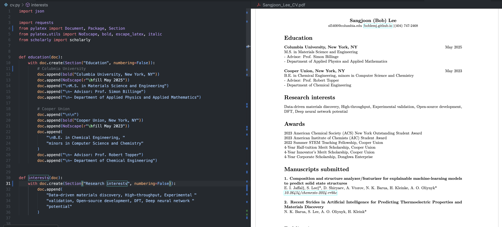
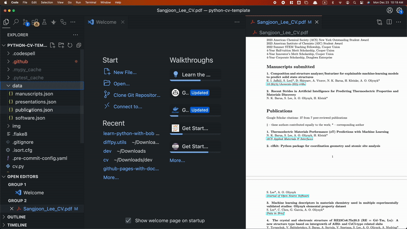

# Bob's Python CV Template



## What urged me to create this repository

I was applying for PhD programs and needed to update my CV quite often. I envisioned a tool that could (1) dynamically parse information such as Google Scholar citations and GitHub star counts, (2) render exactly as I wanted instead of a rigid template, (3) automate rendering for previews. Hence, this became my Winter 2024 personal project for automation and ease the rest of my academic career.

Are you here too for similiar reasons? Are you tired of managing your CV using Overleaf or Microsoft Word?

I also considered the following features in designing:

- **Dynamic:** Automated rendering in 1-2 seconds locally based on `.py` or `.json` changes.
- **Offline:** No internet connection needed to update while on a plane.
- **Customizable:** Anyone can use and build upon this CV template.
- **Simple:** Modular yet retains a single `cv.py` Python file and a `data` folder for easy sharing via chat and email, rather than as a `pip install` library.

## Getting started

It will take about 1-2 minutes to generate `Sangjoon_Lee_CV.pdf`.

After that, it will take 2-3 seconds to render your CV in real-time.

### Step 1: Install dependencies

We need to install the following two dependencies to use Python with LaTeX and retrieve information from Google Scholar.

```bash
pip install PyLaTeX scholarly
```

If the above does not work, create a new conda environment and install `scholarly` and `PyLaTeX`.

```bash
conda create -n cv_env python=3.13
conda activate cv_env
pip install scholarly PyLaTeX
```

### Step 2. Download files

Download the content of this repository by cloning it.

```bash
# Clone the repository
git clone https://github.com/bobleesj/python-cv-template

# Go to the directory
cd python-cv-template

# Render a PDF file
python cv.py
```

`Sangjoon_Lee_CV.pdf` will be generated.

## Step 3: How to render dynamically (optional, but recommended)

Like Overleaf, we want to dynamically render each time the `.json` or `.py` files are modified.

```bash
# Install nodemon
npm install -g nodemon

# Run the following
nodemon --exec python cv.py --watch . --ext py,json
```



As shown above, I recommend using Visual Studio Code and downloading a PDF preview extension. Your CV will be rendered in just 1-2 seconds!

## How to customize my CV?

`cv.py` is the source of truth for the CV. If you want to add more entries, you just need to modifiy `data`

## How to get support

- Want to request new features or have suggestions? Please make an issue!
- Have you encountered any problems? Please make an issue!
- Do you need help customizing your CV? Feel free to reach out via email!
- Have you encountered typos/grammatical errors? Make a pull request!

## How to Show Support and Contribute

- Did you find this project helpful? Please "star" the repository to encourage greater adoption!
- Do you have colleagues and friends who might find this repository useful? Please share it with them!
- Want to contribute to the code? When non-trivial changes are committed from a branch, please run `pre-commit` before creating a pull request:

```bash
# Install pre-commit for automatic linting
pip install pre-commit

# Run pre-commit to standardize the code
pre-commit run --all-files
```

## How to contact maintainer

This repository is created and maintained by @bobleesj. The email address can be found on the GitHub profile.
